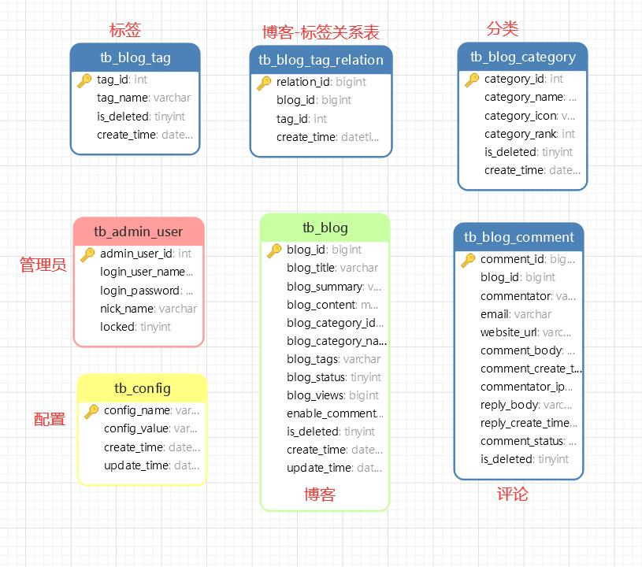
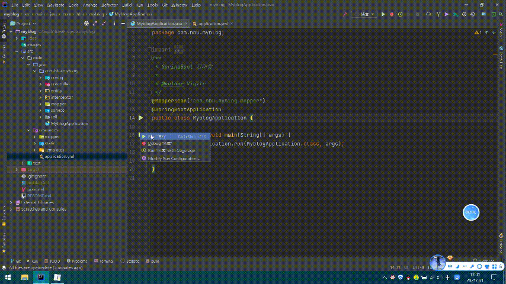
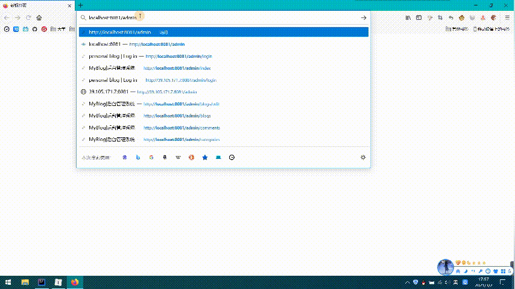
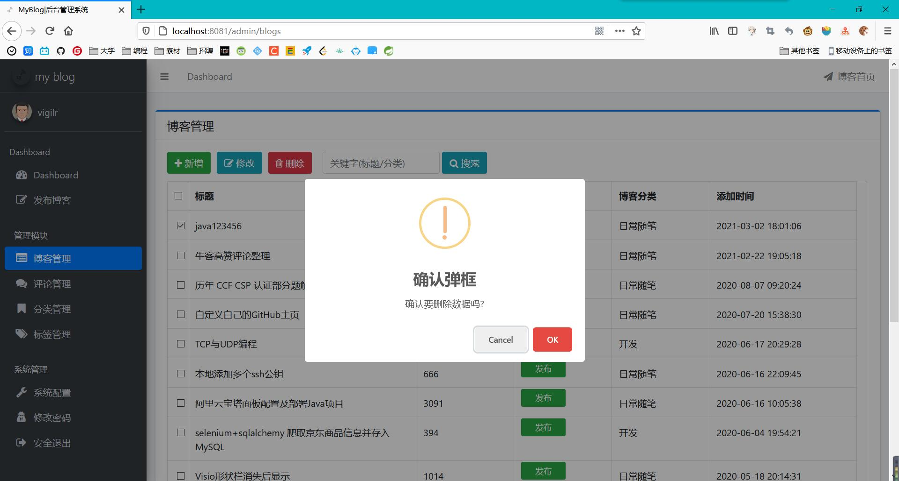
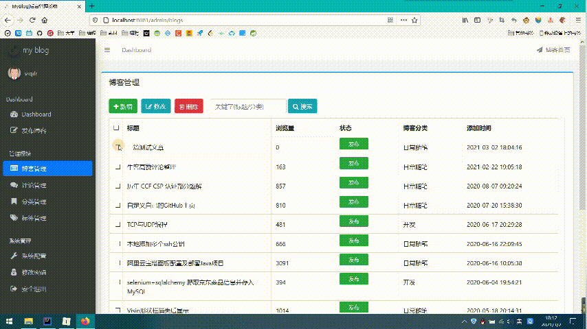
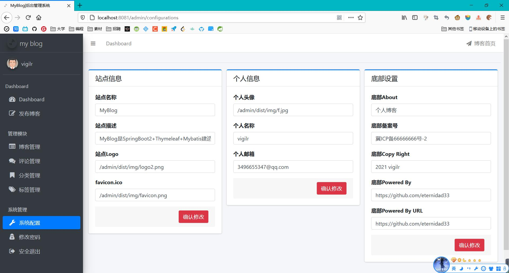

# myblog

## 简介

> 本博客系统是在 github 大佬[十三](https://github.com/ZHENFENG13) 写的 [My-Blog-layui](https://github.com/ZHENFENG13/My-Blog) 的基础上进行的微小的改动
>
> 用到的技术：**SpringBoot** + **mysql** + **thymleaf** + **mybatis**

**项目结构**

```powershell
D:.
│  .gitignore	（git仓库忽略文件）
│  pom.xml	（pom依赖）
│  README.md	（README文件）
│
├─src	（源代码）
│  ├─main	（主程序包）
│  │  ├─java
│  │  │  └─com
│  │  │      └─hbu
│  │  │          └─myblog	（博客模块）
│  │  │              │  MyblogApplication.java	（启动类）
│  │  │              │
│  │  │              ├─config	（配置包）
│  │  │              │      Constants.java	（配置全局文件上传路径）
│  │  │              │      KaptchaConfig.java	（配置验证码）
│  │  │              │      MyBlogWebMvcConfigurer.java	（拦截器配置）
│  │  │              │
│  │  │              ├─controller	（请求处理）
│  │  │              │  ├─admin	（管理员界面发出的请求）
│  │  │              │  │
│  │  │              │  ├─blog	（博客前台发出的请求）
│  │  │              │  │
│  │  │              │  └─common	（验证码请求及异常请求）
│  │  │              │
│  │  │              ├─entity	（实体类）
│  │  │              │
│  │  │              ├─interceptor	（拦截器）
│  │  │              │
│  │  │              ├─mapper	（mybatis映射）
│  │  │              │
│  │  │              ├─service	（服务层）
│  │  │              │  └─impl	（实现类）
│  │  │              │
│  │  │              └─util	（工具包）
│  │  │
│  │  └─resources	（项目资源）
│  │      │  application.yml	（springboot配置文件）
│  │      │
│  │      ├─mapper	（mapper映射）
│  │      │
│  │      ├─static	（静态文件）
│  │      │
│  │      └─templates	（html模板）
│  │ 
│  └─test	（测试类）
│
└─target	（maven项目编译后的文件夹）
```

**数据库设计**



## 如何使用

1. mysql 导入 sql 文件夹下的 myblog.sql 文件

2. 运行 MyblogApplication.java 的main方法

3. 浏览器访问`http://localhost:8081/`博客前台页面

4. 浏览器访问`http://localhost:8081/admin`为博客后台管理页面

   ```yml
   用户名: admin
   密码: 123456
   ```

## 运行效果

**启动**




**首页**


**标签**


**管理员登录界面**




**管理员主界面**


**添加文章**


**删除文章**




**修改文章**




**审核评论**


**系统配置**




## 常见问题

### 端口被占用

报错如下：

```shell
Error starting ApplicationContext. To display the conditions report re-run your application with 'debug' enabled.
2021-03-01 16:58:37.570 ERROR 13000 --- [           main] o.s.b.d.LoggingFailureAnalysisReporter   : 

***************************
APPLICATION FAILED TO START
***************************

Description:

Web server failed to start. Port 8888 was already in use.

Action:

Identify and stop the process that's listening on port 8888 or configure this application to listen on another port.

```

方法1：换端口

> 修改 application.yml 中的端口配置
>
> ```yml
> server:
>   port: 8888
> ```

方法2：停止占用端口的进程

```powershell
//查询8888端口状态
PS C:\Users\Administrator> netstat  -aon|findstr  8888
  TCP    0.0.0.0:8888           0.0.0.0:0              LISTENING       12612
  TCP    [::]:8888              [::]:0                 LISTENING       12612

//根据pid查询端口进程
PS C:\Users\Administrator> tasklist|findstr "12612"
java.exe                     12612 Console                    1    242,716 K

//根据pid停止端口的进程
PS C:\Users\Administrator> taskkill /pid 12612 /F
成功: 已终止 PID 为 12612 的进程。
```

方法3：**关机重启，简单粗暴**